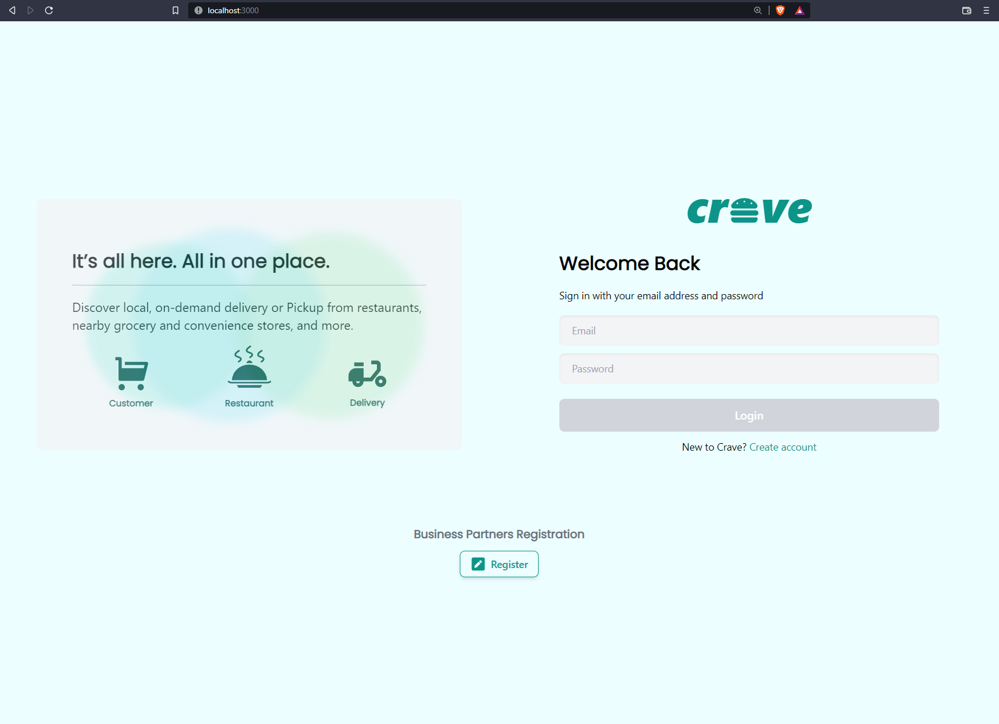
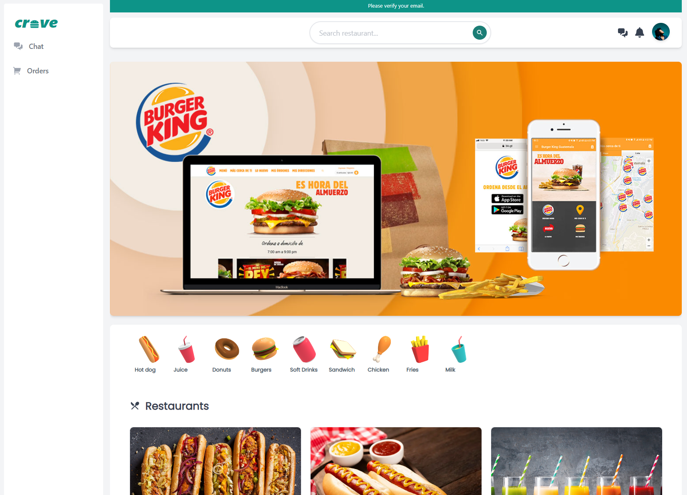
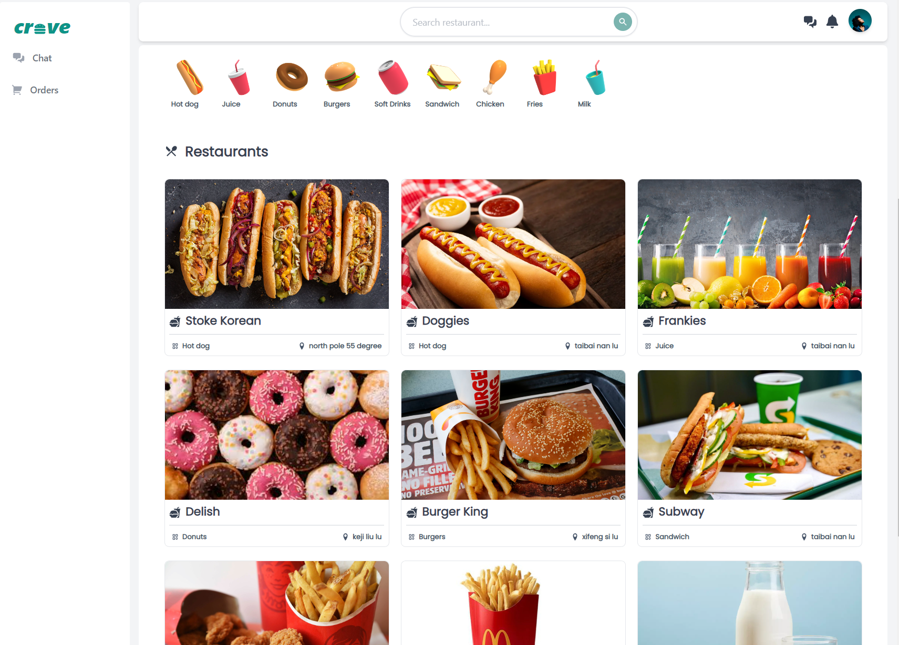
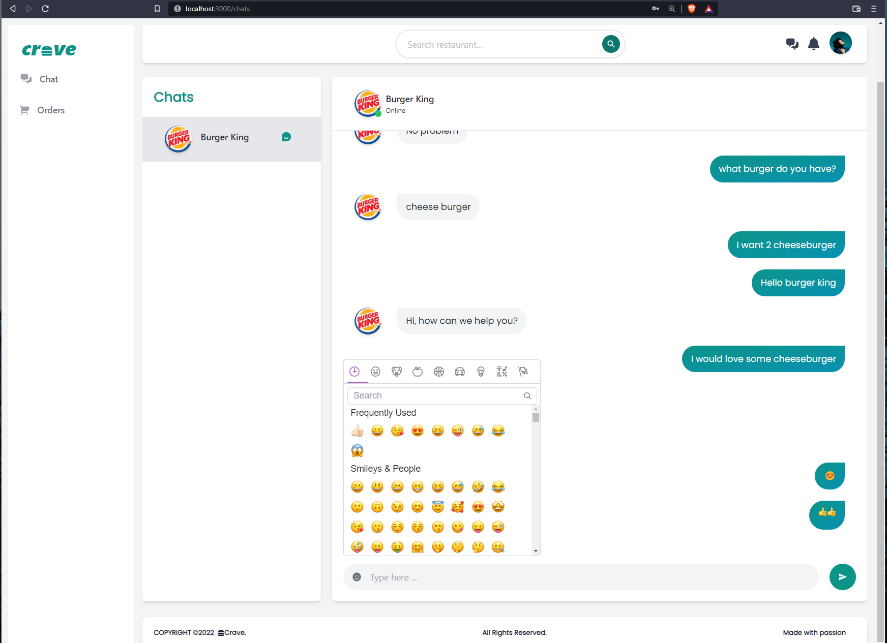
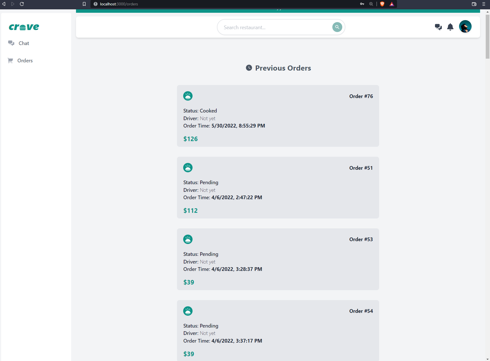
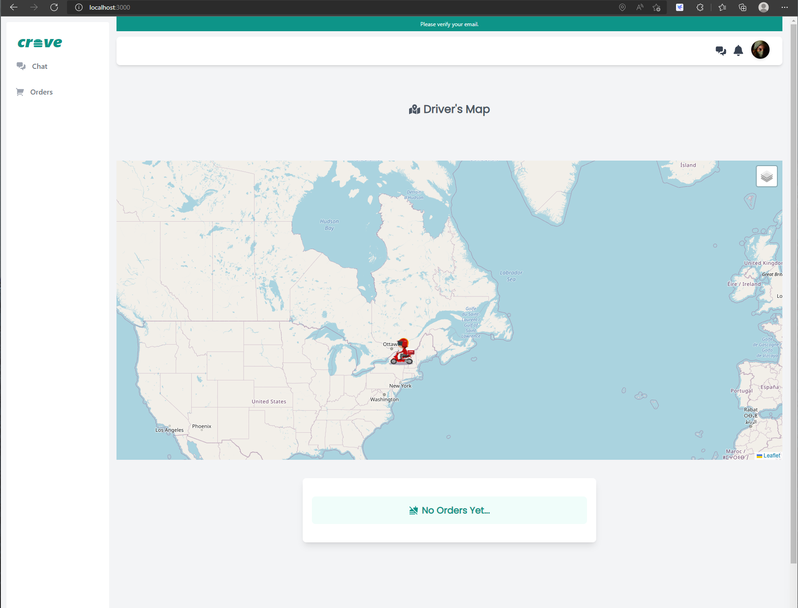
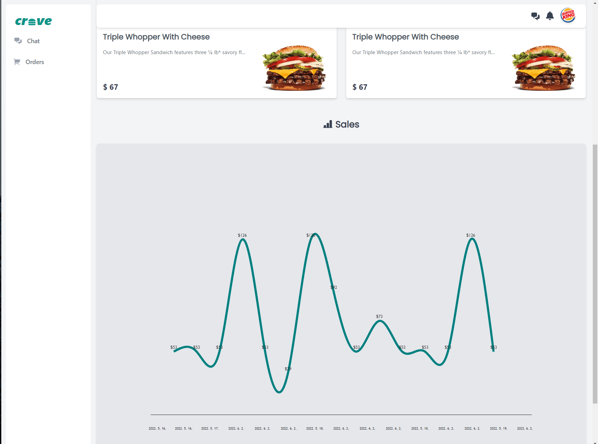

# 🍔 Crave Eats Frontend

## 📖 Overview

This is Crave Eats. 
It is a delivery food service mainly composed of a restaurant, customers, and delivery personnel. 

 

## 🔗 Link to Crave backend Repo

- [crave-frontend](https://github.com/gaelbelami/crave-server)

## 🔗 Link to Crave website

- [Deployed version](https://celebrated-zabaione-7b950c.netlify.app/)

 

## Preview

## Screenshorts of the website

## 💡 Main Users Roles

- 🙍‍♂Client - orders food
- 👨‍🍳Owner - shop owner who runs the restaurant
- 🛵Driver - the delivery person
   

## 📃 Features

- Authentication for all the users based on their roles
- Customer:

  - [x] Ability to RUD his profile
  - [x] Can order meal or cancel order

- Restaurant Owner:

  - [x] Ability to RUD his profile and the restaurant as well
  - [x] Can manage the restaurant
  - [x] Can CRUD dishes
  - [x] Can accept orders
  - [x] Can do much more ...

- Delivery:

  - [x] Ability to RUD his profile
  - [x] Can pick up and deliver orders
  - [x] Can do much more ...

- The delivery process is realtime for all end users

- Ability to communicate through chat(customer, restaurant, delivery)

## 💻 Stack

- [x] Typescript
- [x] React.js
- [x] GraphQL (Apollo Client)
- [x] Victory chart
- [x] Tailwind CSS
- [x] Leaflet.js

## 📝 To Do:

- Customer : add favorite dishes
- Order : add quantity
